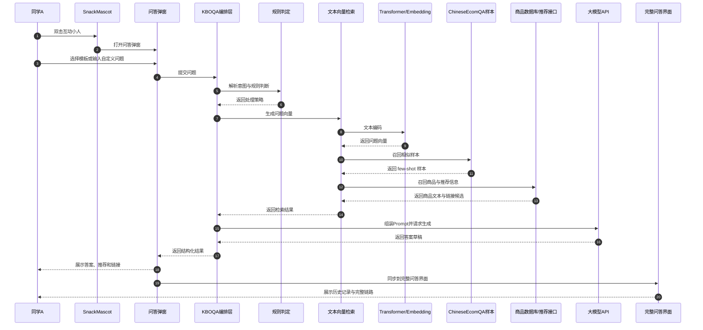

# KBOQA 项目改造方案说明

## 1. 方案目标

本方案面向当前商城项目的智能问答能力改造，目标不是单纯补一个聊天页面，而是构建一个完整的 KBOQA 问答系统。系统应支持：

- 通过互动小人作为入口触发问答
- 支持预输入模板与自定义输入
- 支持结合项目数据进行商品推荐、商品链接返回
- 支持调用大模型 API 生成答案
- 支持利用 `ChineseEcomQA(1).jsonl` 的回答模式优化输出
- 支持进入完整问答界面查看历史记录、推荐结果与链路状态

## 2. 当前状态

[Confirmed] 项目已经具备可复用基础：

- `SnackMascot` 互动小人组件已经存在，可作为入口承载
- 商品、推荐、详情等基础页面和接口已经存在
- `docs/ai-integration.md` 中已有 AI 识别服务的技术栈与分层说明
- `ChineseEcomQA(1).jsonl` 已提供商品品类问答样本，可作为问答样式和输出约束来源

[Unknown] 当前仓库中没有找到已落地的文本向量检索、Transformer 编码或大模型问答编排代码，因此该能力需要作为新增方案设计。

## 3. 问题分析

当前方案要解决的核心问题有三个：

1. 用户入口需要足够自然，不能强迫用户先进入复杂页面
2. 问答系统需要既能“懂问题”，又能“给准答案”，不能完全依赖大模型自由生成
3. 商品推荐和商品链接必须真实、可追溯，不能由模型凭空生成

因此，必须采用“规则 + 检索 + 生成”的组合模式，而不是单纯的聊天机器人。

## 4. 推荐架构

### 4.1 总体架构图

```mermaid
graph TD
    U[用户 / 同学A] --> M[SnackMascot 互动小人]
    M --> D[问答弹窗]
    D --> K[KBOQA 编排层]

    K --> R[规则判定层]
    K --> T[文本向量检索层]
    K --> G[Prompt 组装层]
    G --> L[大模型 API]

    T --> E[Text Embedding / Transformer 编码器]
    T --> S1[ChineseEcomQA(1).jsonl]
    T --> S2[商品数据库]
    T --> S3[商品推荐与详情链接]

    R --> R1[品类判断]
    R --> R2[推荐商品判断]
    R --> R3[链接返回判断]

    L --> O[结构化答案]
    O --> V[结果格式化]
    V --> UI[完整问答界面]
    V --> UI2[推荐商品卡片]
    V --> UI3[商品链接]
```

### 4.2 核心分层

#### 入口层
- 互动小人双击打开问答弹窗
- 弹窗内提供模板与自定义输入
- 支持快速提问和进入完整问答界面

#### 编排层
- KBOQA 负责问答流程控制
- 判断是否走规则优先、检索优先或生成优先
- 统一管理多轮上下文

#### 检索层
- 从商品数据库提取商品信息
- 从样本文件中召回回答模式
- 从商品推荐接口中获取候选推荐
- 从详情接口中获取商品链接
- 新增文本向量检索能力，提升语义召回效果

#### 生成层
- 调用大模型 API 生成自然语言答案
- 对结果做格式约束，保证可展示、可复用

## 5. 文本向量与 Transformer 扩展设计

### 5.1 结论

[Confirmed] 当前项目中**没有现成的文本到向量 / Transformer 语义检索实现**。

[Inferred] 如果要把 KBOQA 做完整，建议新增“文本编码层”，用 Transformer 或 embedding 模型把问题、商品信息、样本答案编码成向量，再做相似度召回。

### 5.2 作用

文本向量化的目的不是替代大模型，而是增强前置检索能力：

- 先用向量召回最相关的商品、样本和类目
- 再把召回结果喂给大模型
- 提高答案准确性、减少幻觉

### 5.3 推荐位置

建议把文本向量能力放在 KBOQA 的“知识检索层”，作为检索增强模块：

- 用户问题 → 编码成向量
- 商品文本/样本文本 → 编码成向量
- 相似度匹配 → 召回最相关上下文
- 召回结果 → 送入 Prompt 组装层

### 5.4 技术路线

可选两种实现方式：

#### 方案 A：轻量 embedding
- 直接使用现成 embedding API 或本地 embedding 模型
- 适合快速上线
- 维护成本低

#### 方案 B：Transformer 编码器
- 使用 Transformer 编码文本
- 适合做更强语义匹配
- 可扩展性更好，但实现复杂度更高

### 5.5 推荐策略

建议采用“先轻后重”的方式：

1. 第一阶段：先实现 embedding 向量召回
2. 第二阶段：再替换或升级为更完整的 Transformer 编码器
3. 第三阶段：结合向量召回与规则匹配，形成混合检索

## 6. 数据利用方式

### 6.1 `ChineseEcomQA(1).jsonl`
该文件建议用于：

- few-shot 示例
- 品类问答模式对齐
- 输出格式约束
- 回答质量评估

### 6.2 商品数据库
用于提供：

- 商品名称
- 商品分类
- 商品价格
- 库存信息
- 商品详情链接

### 6.3 推荐接口
用于提供：

- 同类商品推荐
- 热门商品推荐
- 联动推荐卡片展示

### 6.4 文本向量库
用于提供：

- 问题语义相似召回
- 样本问答召回
- 商品描述召回
- 类目描述召回

## 7. 问答流程设计

### 7.1 主流程

1. 用户双击 SnackMascot
2. 弹出问答框
3. 用户选择模板或输入自定义问题
4. KBOQA 接收问题并解析意图
5. 规则层判断是否属于固定品类问答
6. 向量检索层召回相关商品、样本和类目信息
7. Prompt 组装层构建上下文
8. 调用大模型 API 生成答案
9. 推荐模块补充商品推荐与链接
10. 返回结果到弹窗和完整问答界面

### 7.2 Mermaid 时序图



## 8. 前端交互改造

### 8.1 互动小人
- 双击打开问答弹窗
- 支持状态切换：空闲、接收、思考、回复
- 小人只做入口和状态反馈

### 8.2 问答弹窗
- 支持预输入模板
- 支持自定义输入
- 支持进入完整问答界面

### 8.3 完整问答界面
- 展示消息历史
- 展示 KBOQA 处理状态
- 展示商品推荐和商品链接
- 展示模型返回结果

## 9. 后端改造建议

### 9.1 新增服务能力
建议补充以下服务模块：

- 问题解析服务
- 向量检索服务
- Prompt 组装服务
- 大模型调用服务
- 推荐与链接聚合服务

### 9.2 接口建议
- `POST /api/kboqa/question`
- `POST /api/kboqa/embedding/search`
- `GET /api/kboqa/recommendations`
- `GET /api/kboqa/product-links`

### 9.3 返回结构
建议统一返回：

- `answer`
- `answerType`
- `confidence`
- `recommendations`
- `productLinks`
- `traceId`
- `sourceDocs`

## 10. 风险分析

### 10.1 大模型幻觉
风险：模型生成不准确内容。

缓解：
- 先检索后生成
- 固定类问题优先规则化
- 使用样本文件约束输出风格

### 10.2 向量召回偏差
风险：召回结果不够准。

缓解：
- 商品文本规范化
- 类目描述标准化
- 引入规则兜底

### 10.3 商品链接错误
风险：模型不能生成真实链接。

缓解：
- 链接必须来自数据库或服务接口
- 前端只展示后端返回结果

### 10.4 入口复杂
风险：功能过多导致交互混乱。

缓解：
- 小人只负责入口
- 弹窗只负责快速问答
- 完整问答页负责历史和扩展能力

## 11. 实施顺序

### 第一阶段：入口与流程
- 完成 SnackMascot 双击入口
- 完成问答弹窗
- 完成模板与自定义输入

### 第二阶段：KBOQA 编排
- 完成意图分类
- 完成规则判定
- 完成上下文组装

### 第三阶段：向量增强
- 完成文本向量化
- 完成相似样本召回
- 完成商品文本检索

### 第四阶段：大模型接入
- 接入大模型 API
- 完成回答生成
- 完成结果格式化

### 第五阶段：商品与链接
- 接入推荐接口
- 接入商品详情链接
- 在结果中返回推荐商品卡片

## 12. 影响范围

- 前端首页入口
- 问答弹窗组件
- 完整问答页面
- KBOQA 编排逻辑
- 文本向量检索模块
- 商品推荐与链接接口
- 大模型 API 接入层

## 13. 结论

[Confirmed] 这个方案不是单纯的“聊天机器人”，而是“规则 + 检索 + 向量召回 + 大模型生成”的完整问答系统。

[Confirmed] 当前项目里没有现成的文本向量 / Transformer 实现，但完全可以作为 KBOQA 的扩展层补进去。

[Inferred] 最合理的实施方式是：先做入口与编排，再做向量增强，最后接入大模型与商品推荐，确保准确性和可演示性同时成立。
