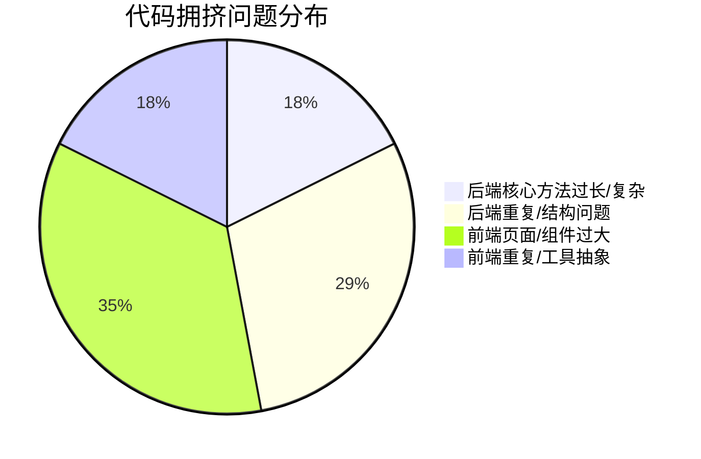

# 项目代码结构与组织审查报告（代码拥挤专项）

**审查日期**：2026-06-24  
**审查范围**：`Test/shop-parent/` 全部 Java 源码 + `shop-web-next/src/` 全部 TS/TSX 源码  
**审查方法**：`lizard` 静态扫描（阈值：文件 >500 行、函数 NLOC >50、圈复杂度 CCN >10）+ 人工抽样复核

---

## 1. 当前状态

- 项目采用 **Spring Cloud 微服务 + Next.js 前端**。
- 后端含 `gateway / user / product / order / payment` 5 个服务，约 80 个 Java 文件。
- 前端约 50 个 TS/TSX 文件。
- `lizard` 统计：总 NLOC **8366**，函数 **499** 个，平均 CCN **1.8**。
- 触发拥挤告警的函数 **13** 个：后端核心方法 **3** 个，前端页面/组件 **10** 个。
- 超过 500 行的文件仅 **1** 个：`auth-fuse.tsx`（705 行）。
- 后端多个工具类在模块间重复实现，目前尚无统一的 `common` 模块。

---

## 2. 问题汇总与重构建议

| 编号 | 问题 | 位置/指标 | 影响 | 重构建议 |
|------|------|-----------|------|----------|
| 1 | **订单创建方法过长、圈复杂度过高** | `OrderServiceImpl.java` `createOrder` NLOC 58 / CCN 14 / 71 行 | 混合参数校验、Feign 调用、库存扣减、订单创建、补偿回滚、指标埋点；修改易引入回归 | 拆分为 `OrderCreateValidator`、`UserResolver`、`StockService`、`OrderFactory`、`CompensationHandler`；使用 Builder 构造订单 |
| 2 | **支付处理方法过长、多分支返回** | `PaymentServiceImpl.java` `processPayment` NLOC 69 / CCN 9 / 78 行 | 同一方法内处理分布式锁、订单查询、支付记录、Feign 状态更新、补偿、结果 Map 组装 | 提取 `PaymentLockManager`、`OrderPaymentValidator`、`PaymentFactory`、`PaymentResultBuilder`、`PaymentCompensator`；用 DTO 替换 `Map<String,Object>` |
| 3 | **商品识别方法过长、嵌套分支多** | `ProductServiceImpl.java` `recognize` NLOC 62 / CCN 12 / 79 行 | 识别调用、降级、目标选择、类别映射、推荐、日志保存全部耦合 | 拆分为 `RecognitionClient`、`RecognitionResultMapper`、`CategoryResolver`、`RecommendationService`、`RecognitionLogger` |
| 4 | **用户控制器文件过大，限流降级处理器内联** | `UserController.java` 225 行 | 文件包含 5 个接口 + 3 个 blockHandler，结果 Map 重复构造 | 将 `blockHandler` 移至独立 `UserBlockHandler`；使用统一 `ResultBuilder`；把参数校验下沉到 Service |
| 5 | **Redis 分布式锁工具类重复** | `order/RedisLockUtil.java` 与 `payment/RedisLockUtil.java` 完全一致 | 重复代码同步维护成本高 | 新建 `shop-common` 模块，提取公共 `RedisLockUtil` |
| 6 | **JWT 工具类在 user/gateway 重复** | `user/JwtUtil.java` 与 `gateway/JwtUtil.java` 高度重复 | 密钥刷新逻辑分散，易不一致 | 统一抽到 `shop-common`，gateway 仅保留校验相关方法或复用完整工具类 |
| 7 | **订单服务中商品名称刷新逻辑重复** | `OrderServiceImpl.java` `findById` 与 `findByUid` 中均含相同刷新逻辑 | 相同容错/刷新逻辑复制两份 | 提取 `ProductNameRefresher` 或 `OrderEnricher` |
| 8 | **Sentinel 异常处理器与规则配置分散重复** | `order/ExceptionHandlerPage.java`、`payment/SentinelExceptionHandler.java`、两套 `SentinelRuleConfig` | 异常码/提示语不统一，规则散落在各服务 | 抽取 `shop-common-sentinel` 统一 `BlockExceptionHandler` 与规则加载器 |
| 9 | **AuthFuse 组件过大，内嵌 UI 基元与打字机动画** | `auth-fuse.tsx` 705 行 | 文件中自定义了 `Typewriter`、`Label`、`Input`、`Button`、`PasswordInput`，与现有 `components/ui` 重复；单文件管理登录/注册/重置三态 | 将 `Typewriter` 拆到 `components/design`；复用现有 `components/ui` 并通过 className 覆盖主题；按模式拆分为 `LoginForm`/`RegisterForm`/`ResetForm` |
| 10 | **拍照识别页面过大，UI 与逻辑混合** | `recognize/page.tsx` NLOC 248 / CCN 13 / 353 行 | 上传、图片预览、检测框绘制、结果列表、推荐商品全部在一个组件 | 拆分为 `ImageUploader`、`DetectionOverlay`、`RecognitionResultPanel`、`ProductRecommendations`；抽取 `useRecognition` hook |
| 11 | **支付页面状态机与 JSX 混杂** | `payment/[orderId]/page.tsx` NLOC 165 / CCN 11 / 263 行 | `idle/processing/success/failed` 四个状态 UI 与倒计时、支付请求、跳转逻辑耦合 | 拆分为 `PaymentIdleView`、`PaymentProcessingView`、`PaymentSuccessView`、`PaymentFailedView`；抽取 `usePayment` hook |
| 12 | **多个页面重复加载/错误/空状态模板** | `orders/[id]/page.tsx`、`products/[id]/page.tsx`、`orders/page.tsx` 等 | 相同骨架屏、错误页、空状态代码反复出现 | 抽象 `PageShell`、`AsyncStateLayout`、`EmptyState`、`ErrorState` 等布局组件 |
| 13 | **自定义 Hook 重复定义** | `useIsClient` 在 `navbar.tsx` 与 `snack-mascot.tsx` 重复；`useReducedMotion` 在 `snack-mascot.tsx` 与 `pixel-hero.tsx` 重复 | 通用客户端/可访问性逻辑未复用 | 提取到 `src/hooks/use-is-client.ts`、`src/hooks/use-reduced-motion.ts` |
| 14 | **API 层返回结构未统一，导致容错代码扩散** | `request.ts` 返回 `response.data` | 调用方大量使用 `result.data \|\| result` 做兜底，遍布 `auth.ts`、各 page | 统一封装 API 方法，确保返回类型一致；移除调用端重复兜底 |
| 15 | **类别映射文件数据与工具函数混合** | `category-mapping.ts` 前 200+ 行为静态数据，后 30 行为工具函数 | 配置数据与逻辑混在一起 | 拆分为 `category-mapping-data.ts` 与 `category-mapping.ts` |
| 16 | **动画/视觉组件文件偏长** | `pixel-hero.tsx` 329 行、`snack-mascot.tsx` 334 行 | Canvas 粒子逻辑、SVG 表情渲染与组件状态耦合 | 将 `PixelCanvas` 拆到 `components/three/pixel-canvas.tsx`；`renderFace` 拆为 `MascotFace` 子组件 |

---

## 3. 问题分布

---

## 4. 影响分析

- **可读性**：核心方法/页面承担多重职责，阅读成本随分支与 JSX 层级增加而显著提高。
- **可维护性**：重复工具类与重复模板代码需要多处同步修改；长函数内的小改动可能触发非预期行为。
- **可扩展性**：新增业务状态（如订单新状态、识别新流程）需要继续堆叠到已有长方法/组件中，进一步加剧拥挤。
- **可测试性**：长方法难以构造单一测试场景；前端大组件难以做单元级快照/交互测试。

---

## 5. 重构方案

### 5.1 后端

1. 新增 `shop-common` 模块，迁移 `RedisLockUtil`、`JwtUtil`、统一 Sentinel 处理器、通用 Result 构造器。
2. 对 `OrderServiceImpl.createOrder`、`PaymentServiceImpl.processPayment`、`ProductServiceImpl.recognize` 按“校验 → 编排 → 执行 → 补偿/日志”拆分，引入小型领域服务/工厂类。
3. 将 `UserController` 的 `blockHandler` 抽出，控制器只负责路由与结果封装。

### 5.2 前端

1. 建立 `src/hooks`、`src/components/layout`、`src/components/async-state` 等目录，统一页面外壳、加载/错误/空状态。
2. 将 `auth-fuse.tsx` 拆分为多个表单子组件，并复用现有 `components/ui`。
3. 对 `recognize`、`payment` 等大页面按“容器 hook + 展示子组件”重构。
4. 统一 API 返回结构，移除 `result.data || result` 的重复兜底。

---

## 6. 风险分析

- 订单/支付核心流程重构需保持现有事务边界、Redis 锁、补偿删除行为不变，否则可能破坏一致性。
- 前端组件拆分涉及状态提升与 props 设计，需避免过度传递。
- 新建 `shop-common` 会调整各服务 `pom.xml`，需验证依赖传递无冲突。

---

## 7. 验证方案

- **后端**：`mvn clean test`、各服务单元测试、订单创建→支付→完成全链路集成测试、库存回滚边界测试。
- **前端**：`next build` / `tsc --noEmit`、关键页面渲染测试、登录→下单→支付→查看订单 e2e 主路径。
- **重复代码**：重构后使用文件 diff/相似度扫描确认旧重复点已消除。

---

## 8. 下一步建议

1. 暂不处理，仅保留报告。
2. 优先重构后端核心服务方法（问题 1-4）。
3. 优先重构前端页面/组件（问题 9-12、15-16）。
4. 优先抽取公共模块/消除重复代码（问题 5-8、13-14）。
5. 按报告逐项全面重构。
